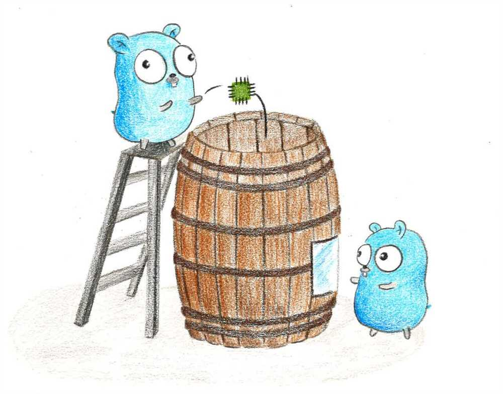

# BARIOT

[IoT][iot] / [IIoT][iiot] Platform

Bariot is a simple solution to send, manage, secure and visualize data from connected devices/machines.

 

 <i> Drawing by Ngoc-Ha </i> 

 

Micro-services architecture build with [Go][go] and [Docker][docker] (compose).

Inspired by the beautiful architecture of [Mainflux][mainflux].

 

## MOTIVATIONS

Bariot is being developed to offer a simple, complete and scalable solution to wide variety of IoT projects.

Bariot uses the most recent (ref 2022) technologies to create a scalable and cloud agnostic IoT/IIoT platform.

Bariot is opinionated, in the sense that storage and communications technologies are predefined (see COMPONENTS)

Bariot is a chance to understand what technologies are used to create cloud applications with modern standards of security, scalability, performances and devops practices. Whether it is purely serverless or containerized, these components (see below) in one form or another are often involved.

Bariot is also a fun project to work on !

 

## INSTRUCTIONS

Deployment on AWS EC2 [here][awsdeploy].

 

## COMPONENTS

### Implemented

- Transport: [MQTT][mqtt]
- Authentication/Authorization: [JWT][jwt]
- USER, THINGS storage: [PostgreSQL][postgresql]
- THINGS DATA storage: [Influxdb][influxdb]
- Services intercommunication: [gRpc][grpc]
- Services messaging: [Nats][nats]
- Data presentation: [Grafana][grafana]
- Reverse proxy: [Nginx][nginx]
- Caching: [Redis][redis]
<<<<<<< HEAD
- Testing: Unit, Integration, Functional [GoTest][gotest]
=======
- Testing Unit, Integration, Functional: [GoTest][gotest]
>>>>>>> feature-doc-n-tests

### Further on the road

- Transport: [OPC-UA][opc-ua]
- Secret storage/management: [Vault][vault]
- CI/CD: [Gitlab][gitlab]
- Permission system: to be decided

 

## IT IS A WORK IN PROGRESS ;)

 

[iot]: https://www.zdnet.com/article/what-is-the-internet-of-things-everything-you-need-to-know-about-the-iot-right-now/
[iiot]: https://www.trendmicro.com/vinfo/us/security/definition/industrial-internet-of-things-iiot
[go]: https://www.freecodecamp.org/news/what-is-go-programming-language/
[docker]: https://docs.docker.com/get-started/overview/
[mainflux]: https://mainflux.com/
[mqtt]: https://mqtt.org/
[jwt]: https://jwt.io/
[postgresql]: https://www.postgresql.org/
[influxdb]: https://www.influxdata.com/
[grpc]: https://grpc.io/docs/what-is-grpc/introduction/
[nats]: https://docs.nats.io/nats-concepts/what-is-nats
[opc-ua]: https://www.opc-router.com/what-is-opc-ua/
[grafana]: https://www.scaleyourapp.com/what-is-grafana-why-use-it-everything-you-should-know-about-it/
[nginx]: https://medium.com/globant/understanding-nginx-as-a-reverse-proxy-564f76e856b2
[redis]: https://redis.io/topics/introduction
[gotest]: https://pkg.go.dev/testing
[vault]: https://www.vaultproject.io/docs/what-is-vault
[gitlab]: https://about.gitlab.com/what-is-gitlab/
[awsdeploy]: https://github.com/pseudoincorrect/Bariot/blob/main/instructions.md
